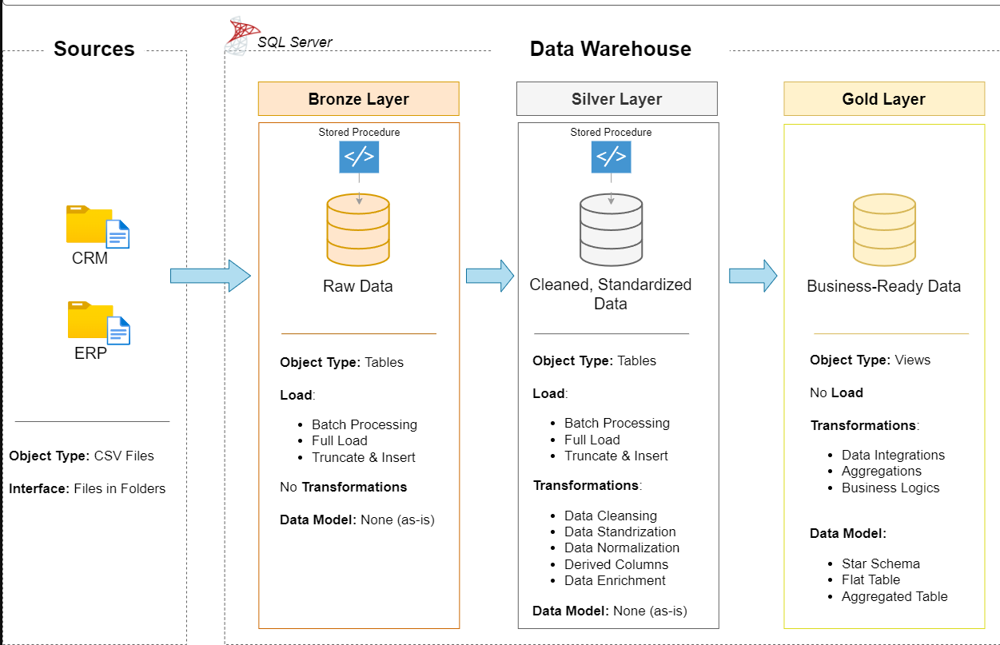

# Data Warehouse and Analytics Project

Welcome to the **Data Warehouse and Analytics Project** repository! 🚀  
This project demonstrates an end-to-end **SQL Server–based data warehousing and analytics solution**, covering raw data ingestion, data cleansing, integration, and analytics-ready modeling.

The project is following industry-standard **Medallion Architecture** and best practices in **data engineering and analytics**.

---
## 🏗️ Data Architecture

The data architecture for this project follows Medallion Architecture **Bronze**, **Silver**, and **Gold** layers:



### 🥉 Bronze Layer — Raw Data
- Stores data **exactly as received** from source systems (ERP and CRM CSV files)
- No transformations or business rules applied
- Preserves original values, including errors and inconsistencies
- Acts as a **source-of-truth layer** for traceability and reprocessing
  
---
## 🥈 Silver Layer – What Happens When Data Comes from Bronze

The Silver layer prepares raw data from the Bronze layer for analytics by improving **data quality and consistency**.

In this layer:

- Read raw tables from the Bronze layer without modifying the original data
- Remove duplicate records based on business keys
- Fix data type issues (e.g. convert strings or integers into proper DATE and numeric types using safe conversions)
- Handle invalid, missing, and null values
- Standardize column names and data formats across all sources
- Clean text fields (trim spaces, normalize values)
- Resolve real-world data issues such as alphanumeric IDs that cannot be cast to integers
- Integrate data from multiple source systems (CRM and ERP) into unified tables
- Validate data quality before passing it to the Gold layer

The Silver layer does **not** perform aggregations or business calculations.  
Its role is to ensure the data is **accurate, consistent, and reliable** before analytical modeling in the Gold layer.

---
### 🥇 Gold Layer — Business & Analytics Ready Data
- Join related Silver-layer tables to create analytics-ready datasets
- Data modeled into a **star schema**
- Organize data into subject areas such as sales, customers, and products
- Creation of **fact and dimension tables**
- Designed to answer business questions efficiently
  
**Typical tables include:**
- FactSales  
- DimCustomer  
- DimProduct

- The Gold layer is designed for **data consumption**, allowing analysts to focus on insights rather than data preparation.

---
## 📂 Repository Structure

```
data-warehouse-project/
│
├── datasets/ # Raw datasets used for the project (ERP and CRM data)
│
├── docs/ # Project documentation and architecture details
│ ├── data_architecture.drawio # Draw.io file showing the architecture
│ ├── data_models.drawio # Draw.io file for star schema data models
│
├── scripts/ # SQL scripts for ETL and transformations
│ ├── bronze/ # Raw data ingestion scripts
│ ├── silver/ # Data cleaning, standardization, integration scripts
│ ├── gold/ # Fact and dimension table creation scripts
│
├── tests/ # Data quality and validation scripts
│
├── README.md # Project overview and instructions
├── LICENSE # License information
└──requirements.txt # Project requirements
```

---
## 🧠 What This Project Demonstrates
- Practical data engineering skills using SQL Server
- Real-world data cleaning and integration techniques
- Medallion Architecture implementation
- Analytical data modeling (Star Schema)
- Job-ready SQL suitable for production environments
